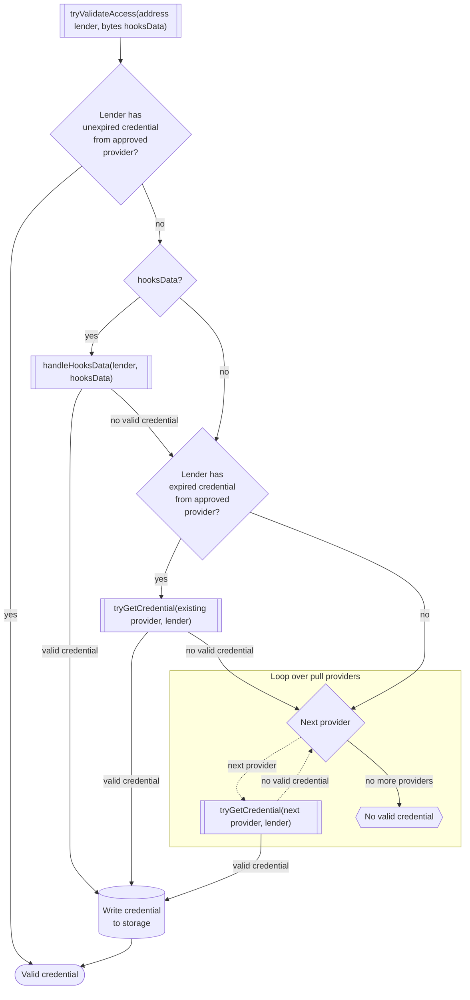
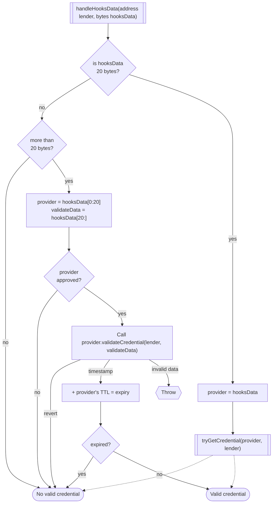

# Access Control Hooks

The `AccessControlHooks` contract has three main features:
- Borrower can define a minimum deposit value.
- Borrower can configure a set of "role providers" - accounts which grant credentials to lenders, where these credentials can be required for deposits, transfer receipt and withdrawal.
- Reduction of a market's APR causes the market's reserve ratio to increase, so the borrower is forced to make it possible for more lenders to exit the market if they substantially reduce the interest rate.

## Market Deployment

When markets are deployed, the hooks factory will call the `onCreateMarket` hook on the hooks instance and use the hooks configuration returned by the call as the final config for the market.

**Hooks Configuration**

When a borrower deploys a market, they provide a `HooksConfig` specifying the flags they want to enable on the market; however, the final set of hooks that will be enabled on the market is decided by the hooks instance, not the borrower.

- `useOnDeposit`
    - If enabled in the borrower's deployment parameters, deposits will require credentials (`depositRequiresAccess`).
    - If `useOnQueueWithdrawal` is enabled, `useOnDeposit` will also be enabled but will not require credentials.
- `useOnTransfer`
    - If enabled in the borrower's deployment parameters, transfers will require recipients have either valid credentials or known lender status (`transferRequiresAccess`).
    - If `useOnQueueWithdrawal` is enabled, `useOnTransfer` will also be enabled but will not require credentials.
- `useOnQueueWithdrawal`
    - If enabled in the borrower's deployment parameters, withdrawals will require credentials.
- `useOnSetAnnualInterestAndReserveRatioBips`
    - Always enabled
- All other hooks are disabled.

The withdrawal, transfer and deposit flags provided by the borrower determine whether these functions will be access-gated; however, if the withdrawal function is access-gated, the deposit and transfer hooks will always be enabled on the market. This is to ensure that if a market requires a credential for withdrawals, any account that ever makes a deposit or receives a transfer while at the same time having a valid credential will always be able to make a withdrawal in the future.

**Minimum Deposit**

The borrower can optionally define a minimum deposit amount by providing an ABI-encoded uint in the `hooksData` field of `HooksFactory.deployMarket` or `HooksFactory.deployMarketAndHooks`.

## Hooks

Note: In the hook summaries, references to having a valid credential refer to invocations of `tryValidateAccess`, which does not require the lender to have an existing cached credential, only that some provider be willing to grant the lender a credential. See the [section below](#tryvalidateaccessaddress-lender-bytes-hooksdata) on this function for further details.

### `onSetAnnualInterestAndReserveRatioBips`

Code: [src/access/MarketConstraintHooks.sol](https://github.com/code-423n4/2024-08-wildcat/blob/156e6044314d363f2e835f5a41b30468df223dbc/src/access/MarketConstraintHooks.sol#L204)

This hook sets some limits on how a borrower can modify the APR of their market.

If they reduce the APR by more than 25%, the market's reserve ratio is set to double the relative reduction in the APR for the next two weeks, e.g. if the APR is 10% and is reduced to 6%, the reserve ratio will be set to 80% for two weeks. The new reserve ratio can not be greater than 100% or less than the market's existing reserve ratio.

If the market does not already have sufficient assets to remain in good standing with the increased reserve ratio, the transaction will revert.

If the APR is changed again during those two weeks:
- If the APR is returned to the original APR or higher, the reserve ratio is reset to the original; otherwise, the temporary reserve ratio is recalculated against the original APR and updated.
- If the APR is a further reduction, the 2 week period resets; otherwise, if it is still lower than the original but >= the previous APR, the reserve ratio is updated without resetting the timer.

At the end of the two weeks, the temporary reserve ratio can be reset by calling `setAnnualInterestAndReserveRatioBips` on the market with the current (reduced) APR and the original reserve ratio.

### `onDeposit`

Code: [src/access/AccessControlHooks.sol](https://github.com/code-423n4/2024-08-wildcat/blob/156e6044314d363f2e835f5a41b30468df223dbc/src/access/AccessControlHooks.sol#L769)

Reverts if:
- The depositor is blocked from depositing, or
- The market requires access for deposits (`depositRequiresAccess`) and the lender does not have a [valid credential](#credentials), or
- The deposit amount is less than the configured minimum
    - The amount is calculated using `scaledAmount` and `intermediateState.scaleFactor`, so it can slightly round up from the actual amount.

Regardless of `depositRequiresAccess`, if the transaction does not revert and the lender has a valid credential, marks them as a [known lender](#known-lenders) for the market.

### `onTransfer`

Code: [src/access/AccessControlHooks.sol](https://github.com/code-423n4/2024-08-wildcat/blob/156e6044314d363f2e835f5a41b30468df223dbc/src/access/AccessControlHooks.sol#L850)

If the recipient is a [known lender](#known-lenders), skips all steps below and returns successfully.

Reverts if:
- The recipient is blocked from deposits, or
- The market requires access for transfer recipients (`transferRequiresAccess`) and the recipient does not have a [valid credential](#credentials)

If the recipient is not a known lender, is not blocked from deposits and has a valid credential, marks them as a known lender for the market.

### `onQueueWithdrawal`

Code: [src/access/AccessControlHooks.sol](https://github.com/code-423n4/2024-08-wildcat/blob/156e6044314d363f2e835f5a41b30468df223dbc/src/access/AccessControlHooks.sol#L812)

Reverts if:
- The lender is not a [known lender](#known-lenders), and
- The lender does not have a [valid credential](#credentials)

## Role providers

A role provider is an Ethereum account that is capable of granting credentials to lenders. It tells the market's access control hooks whether an account meets that provider's criteria and, if the criteria require regular updates, the last time it verified they meet those criteria. Example: a third party KYC provider would say whether an account has passed their KYC process and the last timestamp they did.

Role providers allow a borrower to define who they are willing to do business with and in what ways, using any arbitrary criteria they wish. They might only allow deposits from lenders who can pass some KYC process, or who hold a particular token, or any other check they might be interested in using as an access gate.

When deploying a market, the borrower can specify which functions out of `deposit`, `transfer` (for recipients), and `queueWithdrawal` require a credential. These functions will then only allow approved lenders to interact with those functions on the market (see: [Known Lenders](#known-lenders) for exceptions).

### Managing role providers

The borrower can add and remove role providers at will. When adding a role provider, the borrower specifies a "time to live" (TTL) - the amount of time that a credential granted by that provider will remain valid. For example, they might want to provide access to anyone who has ever met the criteria, in which case the TTL could be `type(uint32).max`, or they might always want to make sure the role provider would still grant the lender a credential in every block, in which case the TTL could be zero.

The provider itself defines whether it is a "pull provider", meaning whether the hooks contract can query the role provider to check if a lender has a credential, using only the lender's address.

### How role providers grant access

Role providers can "push" credentials to the hooks contract by calling `grantRole`:
- `grantRole(address account, uint32 roleGrantedTimestamp) external`

There are three functions that the hooks contract can call on role providers:
- `isPullProvider() external view returns (bool)`
  - Defines whether the hooks contract can retrieve credentials using `getCredential`
- `getCredential(address account) external view returns (uint32 timestamp)`
  - Looks up a credential for an account using only its address, so it must queryable in real time from on-chain data.
- `validateCredential(address account, bytes calldata data) external returns (uint32 timestamp)`
  - Attempts to validate a credential from some arbitrary data (e.g. ecdsa signature or merkle proof).

## Credentials

Code: [src/types/LenderStatus.sol](https://github.com/code-423n4/2024-08-wildcat/blob/main/src/types/LenderStatus.sol)

A credential for a particular lender saves a few things:
- `lastProvider` - The address of the last role provider that granted the lender a credential
- `timeToLive` - The duration in seconds a credential from that provider lasts.
- `canRefresh` - Whether the provider that granted the credential is a "pull provider", meaning the hooks instance can query the provider to try refreshing the credential.

The time to live defines how long credentials are cached, and thus how often they must be refreshed. If a lender has a valid credential when they execute a gated function -- meaning they have been granted a credential which has not expired by a provider that has not since been removed -- they will be granted access to that function.

This can lead to situations where the original role provider might actually not be willing to grant the lender the same credential anymore, but because the cached version is being used, that won't be reflected until the credential expires.

### Credential Revocation

Credentials can be removed in a few ways:
- The credential can expire because the TTL has elapsed.
- The borrower can intervene to block a lender from depositing, which will revoke any credentials they have been granted.
- The provider can revoke credentials for accounts it previously granted.
- The borrower can remove the provider, which will cause all credentials it previously granted to become invalid.

### Known Lenders

`AccessControlHooks` has a second kind of authorization besides the normal credentials, which is the "known lender" status. A known lender is any account that has ever deposited to a market or received market tokens while at the same time having a valid credential. Known lenders do not require valid credentials at the time they queue a withdrawal or receive market tokens.

For a longer explanation of why this is in place, you can review the "mitigation" section of [this PR](https://github.com/wildcat-finance/v2-protocol/pull/33). In short, if a lender has at some point had access to a market and passed the borrower's access requirements, that lender should always have the ability to withdraw from the market as there would be little reason the borrower could give for why they were willing to accept the lender's money but are unable to pay them back unless the lender is sanctioned, in which case the sanctions handling would make this feature moot regardless. 

Once an account is marked as a known lender for a market, they can never lose that flag.

## Checking access

When a restricted function is called, the access control contract will attempt to validate the caller's access to the market in several ways.

The authorization process was designed to minimize the effort needed to get access to a market, so that ideally lenders do not need to submit any additional transactions prior to interacting with the market and can just provide the data needed to validate their access as part of their call to deposit/withdraw/transfer.

Another primary goal with the design is to prevent errors in role providers from bubbling up to the hooks call, as hooks contracts unexpectedly reverting has the potential to break their hooked markets. Other than out-of-gas errors, calls to role providers should only cause the hooks contract to revert in a single case, which is if a lender provides `hooksData` with both a provider address and some extra bytes, and then the call to `provider.validateCredential` returns successfully but returns invalid returndata. This is the one case that can't be allowed to fail gracefully, as `validateCredential` is a stateful function that could cause side effects.

### tryValidateAccess(address lender, bytes hooksData)

To summarize, it first checks if they have a valid credential, then if they provided any data specifying which role provider will grant them a role, then tries to refresh expired credential, and finally tries to query every pull provider in a loop looking for a credential.

In more detail, the process is:

1. If lender has an unexpired credential from a provider that is still supported, return true.
2. If the lender provided `hooksData`, run [`handleHooksData(lender, hooksData)`](#handleHooksDataaddress-lender-bytes-hooksData)
    - If it returns a valid credential, go to step 5
3. If the lender has an expired credential from a pull provider that is still supported, try to refresh their credential with `getCredential` (see: [tryGetCredential](#tryGetCredentialaddress-provider-address-lender))
   - If it returns a valid credential, go to step 5
4. Loop over every pull provider in `pullProviders` (other than the existing provider and provider in `hooksData`, if they exist)
    - Run [tryGetCredential](#tryGetCredentialaddress-provider-address-lender) on each provider.
    - If any returns a valid credential, break the loop and go to step 5
5. If any provider yielded a valid credential, update the lender's status in storage with the new credential and return indicating the account has a credential.
6. Otherwise, return indicating the account does not have a valid credential.

## tryGetCredential(address provider, address lender)

1. If the provider is not approved, return with no valid credential
2. Call `getCredential` on the provider
     - If it reverts, return with no valid credential
3. Add the returned `timestamp` to the provider's TTL to get the expiry
4. If the resulting credential is expired, return with no valid credential
5. Return with valid credential

Note: The "is pull provider?" check is not in the actual `_tryGetCredential` function, but is displayed here as it makes the chart for `tryValidateAccess` easier to follow. The actual function is only called if the provider is not a pull provider.

## handleHooksData(address lender, bytes hooksData)

1. Is `hooksData` 20 bytes?
    - If not, go to 2
    - Set `provider` to `hooksData`
    - Return result of `tryGetCredential(provider, lender)`
2. Is `hooksData` more than 20 bytes?
     - If not, return false
3. Take first 20 bytes as `provider`, the rest is `validateData`
4. If the provider is not approved, return false
5. Call `validateCredential(lender, validateData)`
    - If it reverts, return false
    - If it returns invalid data, throw an error because the call could have side effects
6. Add the returned timestamp to the provider's TTL to calculate the expiry
7. If it is expired, return false
8. Return true
  
