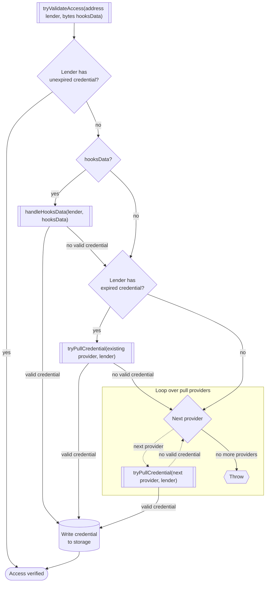
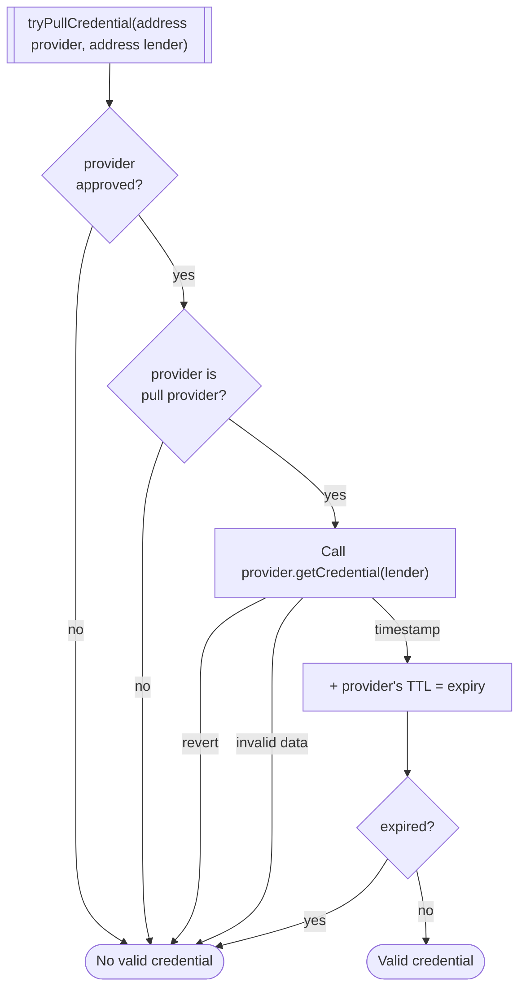

# Access Control Hooks

In the access control hooks, the borrower can configure a set of "role providers" - accounts which grant credentials to lenders.

Within the hooks contract, the borrower configures each provider with a TTL - the amount of time a credential granted by the provider is valid.

The provider itself defines whether it is a "pull provider", meaning whether the hooks contract can query the role provider to check if a lender has a credential, using only the lender's address.

## Role providers

Role providers can "push" credentials to the hooks contract by calling `grantRole`:
- `grantRole(address account, uint32 roleGrantedTimestamp) external`

There are three functions that the hooks contract can call on role providers:
- `isPullProvider() external view returns (bool)`
  - Defines whether the hooks contract can retrieve credentials using `getCredential`
- `getCredential(address account) external view returns (uint32 timestamp)`
  - Looks up a credential for an account using only its address, so it must already be stored somewhere.
- `validateCredential(address account, bytes calldata data) external returns (uint32 timestamp)`
  - Attempts to validate a credential from some arbitrary data (e.g. ecdsa signature or merkle proof).

Role providers do not *have* to implement any of these functions - a role provider can be an EOA.

## tryValidateAccess(address lender, bytes hooksData)

When a restricted function is called, the access control contract will attempt to validate the caller's access to the market in several ways.

1. If lender has an unexpired credential from a provider that is still supported, return true.
2. If the lender provided `hooksData`, run [`handleHooksData(lender, hooksData)`](#handleHooksDataaddress-lender-bytes-hooksData)
    - If it returns a valid credential, go to step 5
3. If the lender has an expired credential from a pull provider that is still supported, try to refresh their credential with `getCredential` (see: [tryPullCredential](#tryPullCredentialaddress-provider-address-lender))
   - If it returns a valid credential, go to step 5
4. Loop over every pull provider in `pullProviders` (other than the existing provider and provider in `hooksData`, if they exist)
    - Run [tryPullCredential](#tryPullCredentialaddress-provider-address-lender) on each provider.
    - If any returns a valid credential, break the loop and go to step 5
5. If any provider yielded a valid credential, update the lender's status in storage with the new credential and return.
6. Otherwise, throw an error.

## tryPullCredential(address provider, address lender)

1. If the provider is not approved, return with no valid credential
2. Call `getCredential` on the provider
     - If it reverts, return with no valid credential
3. Add the returned `timestamp` to the provider's TTL to get the expiry
4. If the resulting credential is expired, return with no valid credential
5. Return with valid credential

## handleHooksData(address lender, bytes hooksData)

1. Is `hooksData` 20 bytes?
    - If not, go to 2
    - Set `provider` to `hooksData`
    - Return result of `tryPullCredential(provider, lender)`
2. Is `hooksData` more than 20 bytes?
     - If not, return false
3. Take first 20 bytes as `provider`, the rest is `validateData`
4. If the provider is not approved, return false
5. Call `validateCredential(lender, validateData)`
    - If it reverts, return false
    - If it returns invalid data, throw an error because the call could have side effects
6. Add the returned timestamp to the provider's TTL to calculate the expiry
7. If it is expired, return false
8. Return true
  
